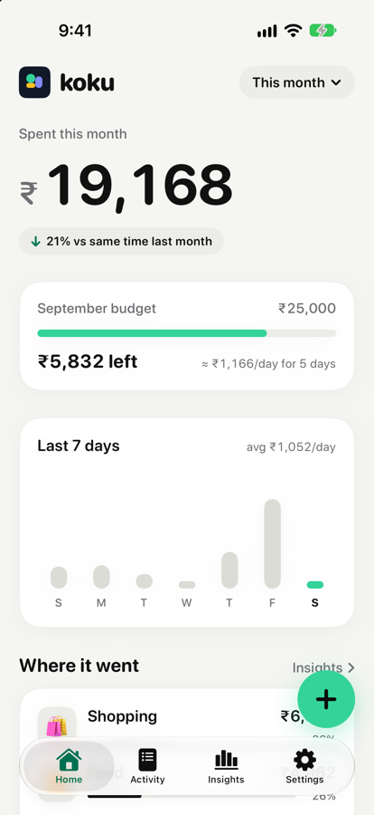
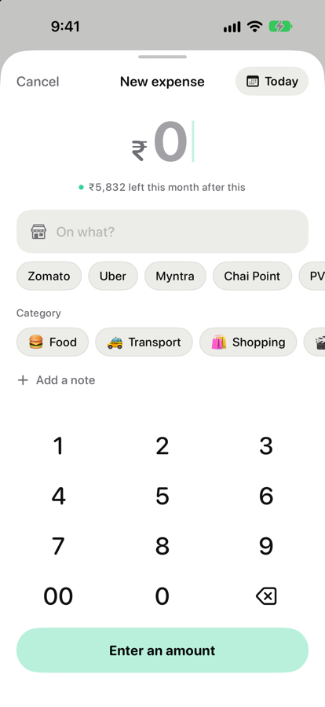
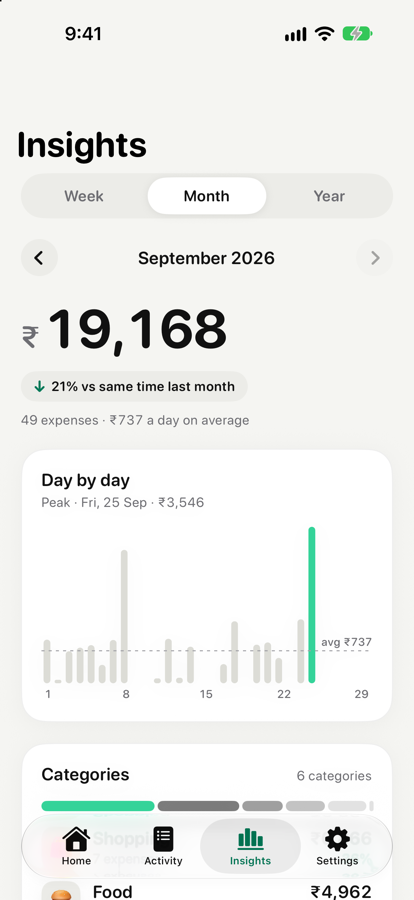
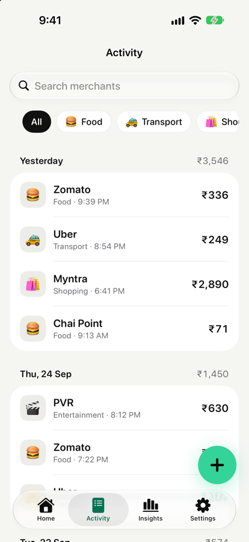
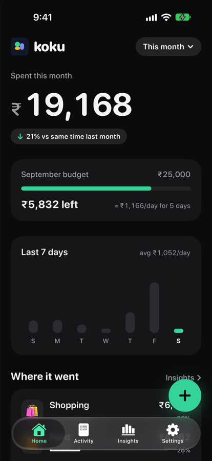
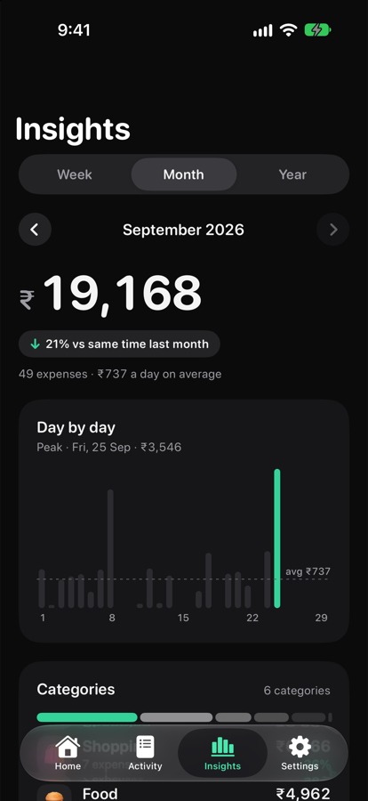
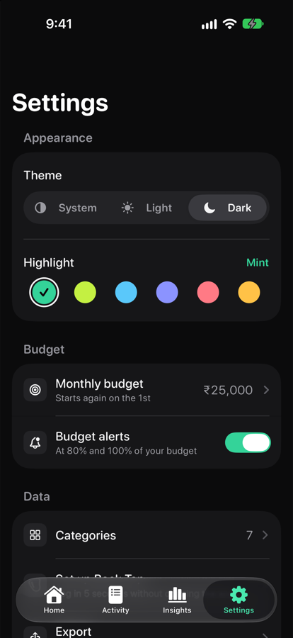

<p align="center">
  
</p>

<h1 align="center">Koku for iOS</h1>

<p align="center">
  A calm, minimalist expense tracker for iPhone where logging a purchase takes about five seconds:<br>
  <b>double-tap the back of the phone → type what it was → type the amount → pick a category.</b> Done.
</p>

<p align="center">
  Swift · SwiftUI · SwiftData · Swift Charts · App Intents · Swift Testing · iOS 26 · no third-party dependencies
</p>

<p align="center">
  Also on Android, with a Quick Settings tile, a home-screen shortcut and phone gestures:
  <a href="https://github.com/Madhav0637/budget-app-android"><b>BudgetApp for Android</b></a>.
</p>

<p align="center">
  
  
  
  
</p>
<p align="center">
  
  
  
  
</p>

## Why

Most expense trackers don't fail because they lack features. They fail because opening an app, finding the add button and filling in a form is just enough friction that people stop logging after a week.

Koku puts entry one gesture away. iPhone's **Back Tap** accessibility feature runs a Shortcut that calls the app's **Log Expense** action. iOS asks three quick questions in a pop-up over whatever you're doing, and the expense is saved without the app ever opening. When you do open the app, it stays quiet: one big number per screen, a neutral canvas, and a single highlight colour for the thing that matters.

## Features

- **Back Tap quick entry.** "On what?" → amount (number pad) → category. Saved silently, in about five seconds.
- **Home.** What you've spent this week, month or year, compared with the same point last time ("↓ 12% vs same time last month"), the last 7 days as a mini chart, where the money went and the latest expenses.
- **Monthly budget.** A progress bar, what's left, and what's safe to spend each day for the rest of the month. A notification when you pass 80% and again at 100%, sent once each per month, including when you log with Back Tap.
- **Insights.** Week, month or year, now or any time before (tap the arrows or swipe). A day-by-day (or month-by-month) bar chart with the peak highlighted and the average marked; tap a bar for its total. Categories with their share, biggest spend, most visited merchant, average per day, no-spend days 🎉 and top merchants.
- **A faster Add screen.** Amount first on a custom keypad. Merchants you've used before appear as one-tap suggestions, and choosing one fills in the category you used last time. Optional note, and any date, not just now.
- **Activity.** Every expense grouped by day with each day's total. Search by merchant (ignores case and accents), filter with category chips, swipe to delete with **Undo**, tap to edit.
- **Light, Dark or System**, with a smooth cross-fade, and a choice of six highlight colours (mint, lime, sky, periwinkle, coral, amber).
- **Categories.** Seven defaults, each with an emoji. Add your own, rename them, and move all of a category's expenses elsewhere. Every list shows the most-used categories first.
- **Export.** A **CSV** spreadsheet (now with notes) for Excel, Numbers or Google Sheets, or a **PDF** report with totals, a category breakdown and every expense.
- **Private by design.** Everything stays on the iPhone. No account, no server, no network access.
- **Indian rupees**, with Indian digit grouping (₹1,23,456).

## How quick entry works

```
Back Tap (double-tap the back of the iPhone)
   └─▶ Shortcut containing the "Log Expense" action
         └─▶ LogExpenseIntent (App Intents, runs inside the app's process)
               ├─ asks "On what?"      → String
               ├─ asks "Amount (₹)"    → Int, number pad
               ├─ asks "Category"      → list from CategoryQuery, most-used first
               ├─▶ ExpenseService.add(...) → SwiftData store on the device
               └─▶ BudgetService: crossed 80% or 100% this month? → one notification
```

The intent has no default values, so iOS prompts for each parameter in order. It requires an unlocked device and returns no dialog, so the entry saves without interrupting you. The only exception is the budget notification, sent at most twice a month.

## Design

The redesign was explored in Google Stitch, then built natively in SwiftUI:

- **One hero number per screen.** Totals are large, rounded and roll between values; everything else is quieter.
- **Neutral canvas, one highlight.** Warm off-white (or near-black) surfaces, graphite text, and one highlight colour used only for the add button, progress, selection and the chart's key bar. Category emoji supply the rest of the colour, so charts stay monochrome.
- **Motion with a purpose.** Springy buttons, a sliding segmented control, bars that grow in, numbers that roll, a checkmark on save and haptics on every key. Grow-in animations respect Reduce Motion.
- **iOS 26 native.** The Liquid Glass tab bar minimises on scroll; everything uses system fonts (SF Pro Rounded), Dynamic Type-friendly text styles and VoiceOver labels.
- **Themes apply to the window**, not just SwiftUI views, so sheets, alerts and the share sheet follow Light / Dark / System too.

## Architecture

```
Back Tap → Shortcut → LogExpenseIntent ──┐
                                         ├──→ Services ──→ SwiftData store (on device)
SwiftUI screens (Add/Edit, Categories) ──┘       ↑
                                                 │ read-only
SwiftUI screens (Home, Activity, Insights) ─ queries
```

- **Every write goes through a service** (`ExpenseService`, `CategoryService`). The Shortcut and the app's screens therefore share one set of rules, for example "amount must be more than ₹0" or "category names are unique regardless of case". An invalid edit changes nothing.
- **Screens read through SwiftData `@Query`**, so lists refresh by themselves when the Shortcut saves an expense.
- **Calculations are plain functions** with no UI or database code: `PeriodCalculator` (Monday-start weeks, earlier periods, "same point last month"), `SpendingSummary`, `PeriodInsights` and `PeriodComparison`, `BudgetPace` and `BudgetAlerts`, `MerchantSuggestions`, `KeypadInput`, `HistoryFilter`, `CSVExporter` and `PDFReport` are all tested directly.
- **Settings live in `UserDefaults`**, read with `@AppStorage` in screens and directly by the intent, so the budget and its alert record are shared between the app and Back Tap.
- **No view model per screen.** `@Query` is designed to live in views, and a view-model layer would add code without adding value at this size.
- **The intent lives in the main app target**, so it shares the app's database and needs no paid developer-account capabilities.

<details>
<summary><b>Project structure</b></summary>

```
BudgetApp/
├── App/           # Entry point, tab bar, the shared SwiftData container, demo data (debug builds)
├── DesignSystem/  # Colours, highlight and theme, cards, chips, pill picker, keypad, toasts, logo
├── Models/        # Expense, Category (@Model)
├── Services/      # ExpenseService, CategoryService, PeriodCalculator, SpendingSummary, PeriodInsights,
│                  # Budget (pace, alerts, settings keys), BudgetNotifier, MerchantSuggestions,
│                  # HistoryFilter, CSVExporter, PDFReport, ExportWriter
├── Intents/       # LogExpenseIntent, CategoryEntity + CategoryQuery
├── Features/
│   ├── Home/
│   ├── Activity/
│   ├── Insights/
│   ├── ExpenseForm/   # Add / Edit
│   └── Settings/      # Budget, Categories, Export, Back Tap guide
└── Shared/        # ₹ and date formatting, the expense row
BudgetAppTests/    # Swift Testing suites
BudgetAppUITests/  # XCUITest flows on sample data
docs/SPEC.md       # Product spec and decision log
tools/             # Script that draws the app icon
```
</details>

## Design decisions worth mentioning

- **Kept the iOS pop-up over a custom screen for Back Tap.** iOS draws a text prompt smaller than a number prompt, and apps can't change the fonts of system UI. A full-screen in-app entry screen was tried and dropped: a pop-up over whatever is on screen beat switching to a full-screen app. The in-app Add screen is where the custom keypad lives.
- **Comparisons are fair.** On 26 September, this month is compared with 1–26 August, not the whole of August.
- **Budget alerts fire once per level per month**, remembered in `UserDefaults`, so the app and Back Tap never double-notify, and jumping straight past 100% sends one alert, not two.
- **Money is an `Int` of whole rupees**, not a `Double`, so totals never pick up floating-point rounding errors.
- **Weeks always start on Monday**, whatever the phone's region setting, and a period includes its first instant but not the next period's first instant.
- **The note is optional in the database**, so stores from before the redesign open without a migration step (checked by installing the new version over the old one with data in it).
- **Exports are written as real files before sharing**, and the CSV defuses text starting with `=`, `+`, `-` or `@` so spreadsheets don't run it as a formula.

## Testing

**Unit tests** (Swift Testing) cover every service and calculation, each with its own in-memory SwiftData container and dates in a fixed time zone. **UI tests** (XCUITest) drive the real app on sample data: adding an expense via a suggested merchant, a new merchant that needs a category, swipe-to-delete and Undo, deleting from the edit sheet, category filters, browsing Insights, setting a budget, and switching theme and highlight colour.

| Suite | Covers |
|---|---|
| ExpenseService | Validation, trimming, notes, add, edit, delete and restore |
| CategoryService · Category management | Default categories, usage order, unique names, emoji validation, move all, delete rules |
| PeriodCalculator · PeriodInsights | Monday-start weeks, month/year boundaries, earlier periods, "same point last month", buckets, averages, no-spend days, peaks, merchants |
| Budget | Pace and per-day allowance, alert levels, once-a-month alerts, messages, the service around a save |
| MerchantSuggestions · KeypadInput | Recency, case/accent-insensitive matching, category from last use; keypad digits, 00, delete and limits |
| SpendingSummary · HistoryFilter | Totals, per-category amounts, recent expenses; search, category filter, day groups and totals |
| CSVExporter · Export | CSV format and escaping, the note column, real `.csv`/`.pdf` files, PDF contents and pagination |
| KokuUITests | The flows above, end to end |

Run them with **⌘U** in Xcode, or from the command line:

```sh
xcodebuild test -project BudgetApp.xcodeproj -scheme BudgetApp \
  -destination 'platform=iOS Simulator,name=iPhone 18 Pro'
```

Add `-only-testing:BudgetAppTests` to skip the slower UI tests. For screenshots, debug builds accept `-demoData` (sample spending in a throwaway store), `-startTab home|activity|insights|settings`, `-openAdd YES`, `-appearance light|dark` and `-monthlyBudget 25000`.

## Getting started

**Requirements:** Xcode 27, and an iPhone on iOS 26 (Back Tap needs a real iPhone 8 or later). A free Apple ID is enough to run it on your own phone.

1. Clone the repo and open `BudgetApp.xcodeproj`.
2. Under **Signing & Capabilities**, choose your own team and change the bundle identifier to something unique.
3. Select your iPhone and press **⌘R**.
4. Set up Back Tap (the app has the same guide under Settings → Set up Back Tap):
   1. In **Shortcuts**, create a shortcut with the **Log Expense** action and leave its fields empty.
   2. Go to **Settings → Accessibility → Touch → Back Tap → Double Tap** and choose that shortcut.

With a free Apple ID, the app stops opening after 7 days. Run it from Xcode again to reinstall it; your data is kept as long as you don't delete the app. Updating from BudgetApp 1.0 keeps all your expenses and your Back Tap shortcut.

## Not in scope (yet)

Income, per-category budgets, recurring expenses, widgets, iCloud sync (including with the Android app) and multiple currencies. See the spec for the full list.

---

Built by **Madhav Agrawal** ([@Madhav0637](https://github.com/Madhav0637)) as a learning and portfolio project. Released under the [MIT License](LICENSE).
