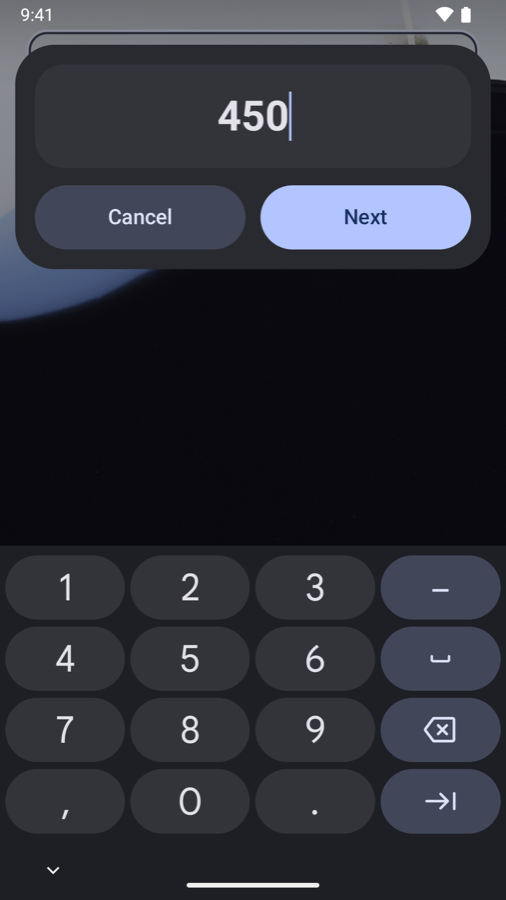
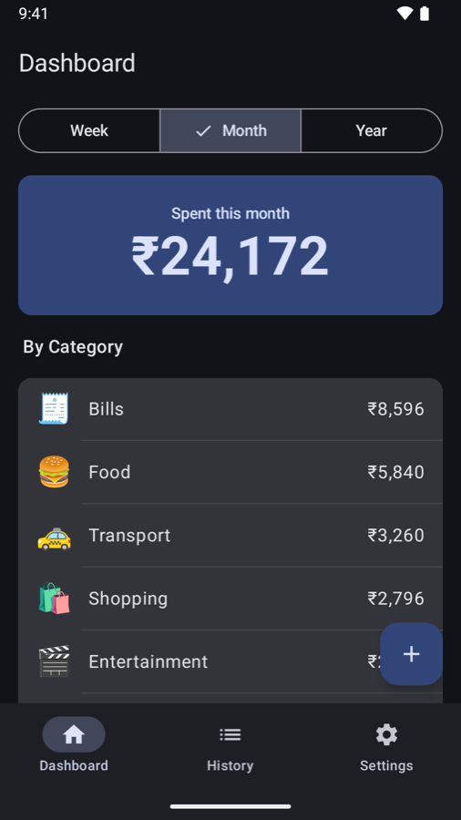
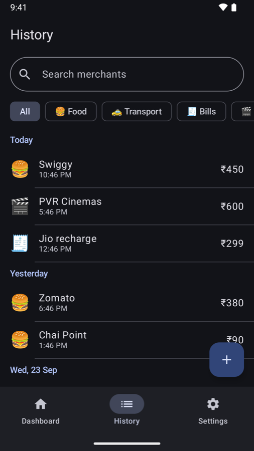
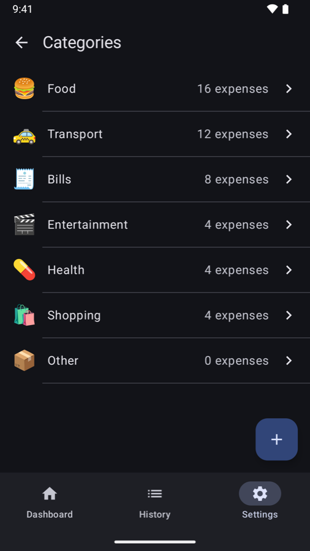
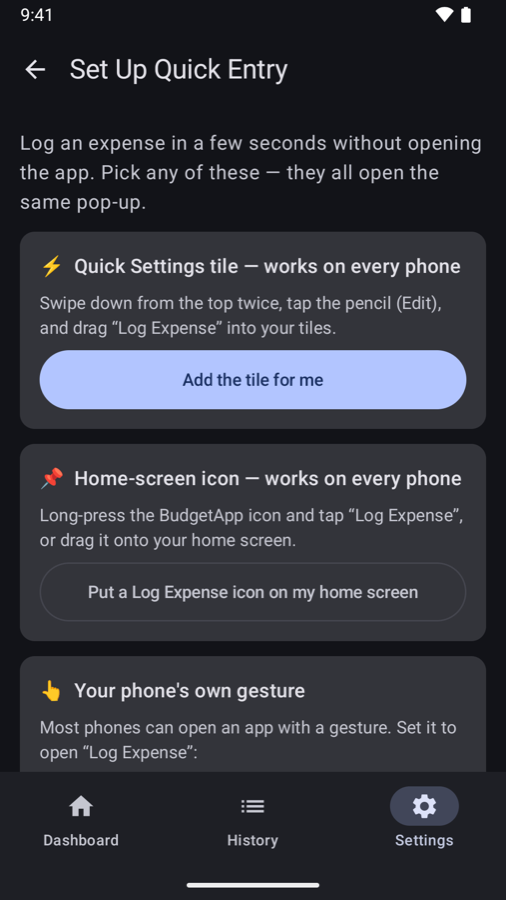
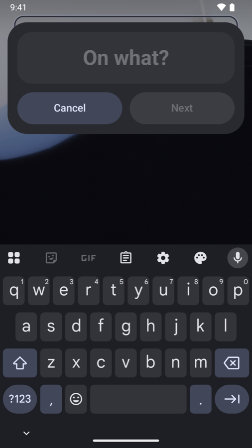
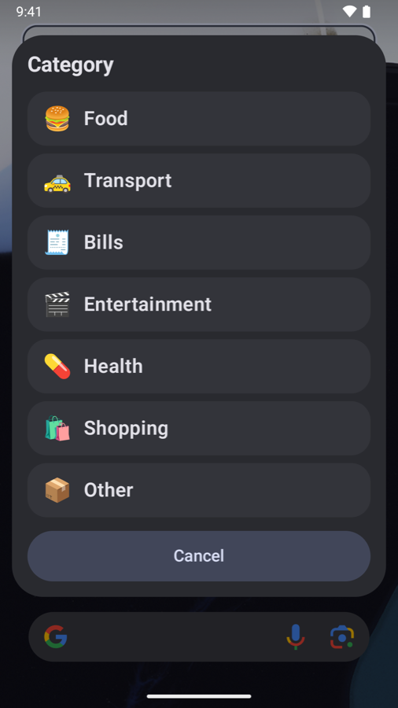
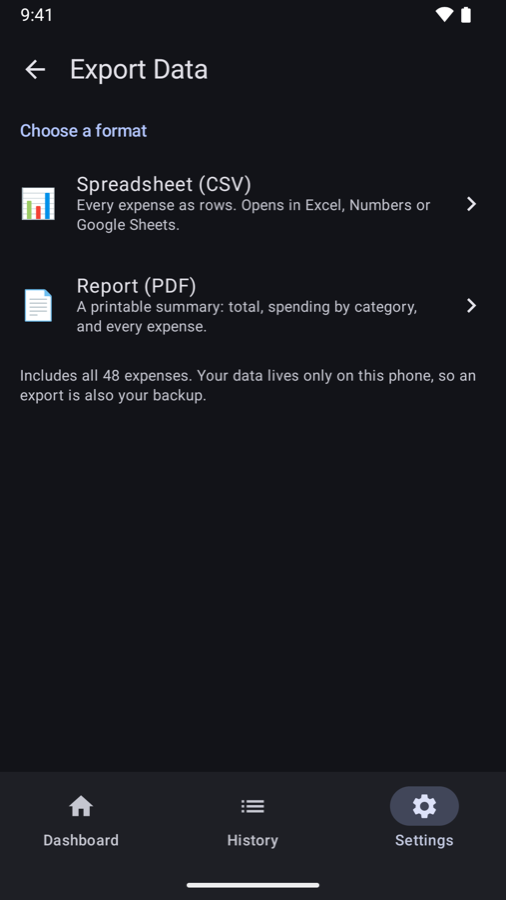

<p align="center">
  
</p>

<h1 align="center">BudgetApp</h1>

<p align="center">
  A personal expense tracker for <b>iPhone and Android</b> where logging a purchase takes about five seconds:<br>
  <b>one gesture → type what it was → type the amount → pick a category.</b> Done.
</p>

<p align="center">
  <b>iOS:</b> Swift · SwiftUI · SwiftData · App Intents · Swift Testing · iOS 26<br>
  <b>Android:</b> Kotlin · Jetpack Compose · Room · JUnit · Android 8.0+<br>
  Both native, no third-party dependencies beyond Google's Jetpack libraries.
</p>

<table align="center">
  <tr>
    <th>iPhone: double-tap the back</th>
    <th>Android: tile, shortcut or gesture</th>
  </tr>
  <tr>
    <td align="center"></td>
    <td align="center"></td>
  </tr>
  <tr>
    <td align="center"><sub>Recorded on an iPhone 13. iOS asks three questions in a pop-up and saves.</sub></td>
    <td align="center"><sub>The app's own pop-up floats over whatever is on screen.</sub></td>
  </tr>
</table>

## Why

Most expense trackers don't fail because they lack features. They fail because opening an app, finding the add button and filling in a form is just enough friction that people stop logging after a week.

BudgetApp puts entry one gesture away on both platforms:

- **iPhone:** the **Back Tap** accessibility feature runs a Shortcut that calls the app's **Log Expense** action. iOS asks three quick questions in a pop-up over whatever you're doing, and the expense is saved without the app ever opening.
- **Android:** no hardware gesture exists on every Android phone, and apps can't listen to the power button. So the same pop-up is reachable three ways: a **Quick Settings tile** and a **home-screen shortcut**, which work on every phone, plus the phone's **own gesture** (Samsung's side-button double press, Pixel's Quick Tap and similar), which opens a dedicated "Log Expense" entry.

## Features

Both apps have the same features and follow the same rules:

- **Quick entry.** "On what?" → amount (number pad) → category, most-used first. Saved silently, in about five seconds.
- **Dashboard.** Switch between this week, month or year, and the choice is remembered. See the total, spending by category (highest first) and the latest expenses.
- **History.** Every expense, grouped by day ("Today", "Yesterday", "Mon, 21 Sep"). Search by merchant (ignores case and accents), filter by category, swipe to delete, tap to edit. On Android, deleting shows an Undo bar.
- **Categories.** Seven defaults, each with an emoji. Add your own, rename them, and move all of a category's expenses elsewhere. A category can't be deleted while it's in use or if it's the last one.
- **Export.** A **CSV** spreadsheet for Excel, Numbers or Google Sheets, or a **PDF** report with totals, a category breakdown and a paginated table of every expense.
- **Private by design.** Everything stays on the phone. No account, no server, no network access.
- **Indian rupees**, with Indian digit grouping (₹1,23,456). Dark mode throughout.

### iPhone

<p align="center">
  
  
  
  
</p>

### Android

<p align="center">
  
  
  
  
</p>

<p align="center">
  
  
  
  
</p>

## How quick entry works

**iPhone**

```
Back Tap (double-tap the back of the iPhone)
   └─▶ Shortcut containing the "Log Expense" action
         └─▶ LogExpenseIntent (App Intents, runs inside the app's process)
               ├─ asks "On what?"      → String
               ├─ asks "Amount (₹)"    → Int, number pad
               ├─ asks "Category"      → list from CategoryQuery, most-used first
               └─▶ ExpenseService.add(...) → SwiftData store on the device
```

The intent has no default values, so iOS prompts for each parameter in order. It requires an unlocked device and returns no dialog, so the entry saves without interrupting you.

**Android**

```
Quick Settings tile ──────────┐
Long-press shortcut ──────────┼─▶ QuickEntryActivity (see-through window over the current app)
"Log Expense" launcher entry ─┘      ├─ "On what?"   big text box
  (brand gestures open this)         ├─ "Amount (₹)" same big box, number pad
                                     ├─ category list, most-used first
                                     └─▶ ExpenseService.add(...) → Room database on the device
```

On Android the app draws the pop-up itself, so both text steps use the same big, bold style. On iOS the system draws its prompts and apps can't change their fonts.

## Architecture

Both apps use the same layering: **every write goes through a service**, screens read data that refreshes by itself, and all calculations are plain functions with no UI or database code.

```
iPhone
Back Tap → Shortcut → LogExpenseIntent ──┐
                                         ├──→ Services ──→ SwiftData (on device)
SwiftUI screens (Add/Edit, Categories) ──┘       │
SwiftUI screens (Dashboard, History) ◀── @Query ─┘   (read-only, refreshes by itself)

Android
Tile / shortcut / gesture → quick-entry pop-up ──┐
                                                 ├──→ Services ──→ Room (on device)
Compose screens → ViewModels ────────────────────┘       │
Compose screens ◀── ViewModels ◀── Flow ─────────────────┘   (read-only, refreshes by itself)
```

- **One set of rules per platform.** `ExpenseService` and `CategoryService` enforce things like "amount must be more than ₹0" and "category names are unique regardless of case" for every entry point. An invalid edit changes nothing.
- **Calculations are ported one to one:** `PeriodCalculator` (Monday-start weeks), `SpendingSummary`, `HistoryFilter` and the CSV exporter behave the same on both platforms, and the Android tests mirror the iOS ones.
- **iOS** reads through SwiftData's `@Query` directly in views, without per-screen view models. **Android** follows the platform's standard pattern: Room returns `Flow`s, and ViewModels combine them into screen state.
- **Deleting a category that's in use is refused twice:** by the service, and by the database itself (`.deny` on iOS, a `RESTRICT` foreign key on Android).

<details>
<summary><b>Project structure</b></summary>

```
BudgetApp/                 # iOS app
├── App/                   # Entry point, tab bar, the shared SwiftData container
├── Models/                # Expense, Category (@Model)
├── Services/              # ExpenseService, CategoryService, PeriodCalculator, SpendingSummary,
│                          # HistoryFilter, CSVExporter, PDFReport, ExportWriter
├── Intents/               # LogExpenseIntent, CategoryEntity + CategoryQuery
├── Features/              # Dashboard, History, ExpenseForm, Settings
└── Shared/                # ₹ formatting, the expense row
BudgetAppTests/            # Swift Testing suites

Android/app/src/main/java/com/madhav0637/budgetapp/
├── data/                  # Room entities, DAOs, database (seeds the default categories)
├── domain/                # Services and plain-Kotlin rules: periods, summary, filter, CSV, report content
├── export/                # CSV/PDF file writer, PDF renderer
├── tile/                  # Quick Settings tile
└── ui/                    # quickentry (the pop-up), dashboard, history, settings, components
Android/app/src/test/      # JVM tests for the domain layer
Android/app/src/androidTest/ # On-device tests against an in-memory Room database

docs/SPEC.md               # Product spec and decision log for both apps
tools/                     # Scripts that draw the iOS and Android app icons
```
</details>

## Design decisions worth mentioning

- **iOS: kept the system pop-up over a custom screen.** iOS draws a text prompt smaller than a number prompt, and apps can't change the fonts of system UI. A full-screen in-app entry screen with matching big text was built and tried, then dropped: a pop-up over whatever is on screen beat switching to a full-screen app. **Android can have both**, so its pop-up is the app's own see-through window with matching boxes.
- **Android: a second "Log Expense" launcher entry.** Brand gesture settings can open an app but not a specific screen, so the pop-up is also its own launcher entry. The cost is a second icon in the app drawer.
- **Money is a whole number of rupees** (`Int` / `Long`), never a floating-point type, so totals never pick up rounding errors.
- **Weeks always start on Monday**, whatever the phone's region setting. A period includes its first instant but not the next period's first. Tests pin down Sunday nights, New Year and leap years.
- **Exports are written as real files before sharing** (a `FileProvider` on Android). Handing the share sheet plain text made some destinations save a `.csv` as `.txt`.
- **The CSV escapes commas, quotes and line breaks**, and prefixes text starting with `=`, `+`, `-` or `@` with an apostrophe so spreadsheets don't run it as a formula (CSV injection).
- **Android: Undo works on the same row.** A restored expense keeps its id, so the swipe state is reset after each delete. Otherwise the restored row would reappear already swiped away and be deleted again, a bug the testing caught.

## Testing

| | Tests | Where they run |
|---|---|---|
| **iOS** | **80 tests (102 cases** with parameterised inputs) across 8 suites, Swift Testing | Simulator; each test gets its own in-memory SwiftData container |
| **Android** | **46 JVM tests** for the domain layer | Your computer, no emulator needed |
| | **18 on-device tests** for the services, database queries and real CSV/PDF files | Emulator or phone, against an in-memory Room database |

Dates are built in a fixed time zone (India Standard Time), so results are the same on any machine. What's covered on both platforms: validation and trimming; add, edit and delete (an invalid edit changes nothing); default categories and most-used order; unique names; emoji checks; move-all and the delete rules; Monday-start weeks and period boundaries; totals and category order; search, filter and day grouping; CSV format and escaping; the PDF's contents and pagination.

**Running them**

```sh
# iOS: or ⌘U in Xcode (swap in any simulator you have installed)
xcodebuild test -project BudgetApp.xcodeproj -scheme BudgetApp \
  -destination 'platform=iOS Simulator,name=iPhone 18 Pro'

# Android JVM tests (from the Android/ folder)
./gradlew testDebugUnitTest

# Android on-device tests, with an emulator or phone connected
./gradlew connectedDebugAndroidTest
```

Note: `connectedDebugAndroidTest` uninstalls the app when it finishes, which deletes any expenses on that device. To keep your data, install both APKs with `adb install -r` and run `adb shell am instrument -w com.madhav0637.budgetapp.test/androidx.test.runner.AndroidJUnitRunner` instead.

## Getting started

### iPhone

**Requirements:** Xcode 27, and an iPhone on iOS 26. Back Tap needs a real iPhone 8 or later. A free Apple ID is enough to run it on your own phone.

1. Clone the repo and open `BudgetApp.xcodeproj`.
2. Under **Signing & Capabilities**, choose your own team and change the bundle identifier to something unique.
3. Select your iPhone and press **⌘R**.
4. Set up Back Tap. The app has the same guide under Settings → Set Up Back Tap.
   1. In **Shortcuts**, create a shortcut with the **Log Expense** action and leave its fields empty.
   2. Go to **Settings → Accessibility → Touch → Back Tap → Double Tap** and choose that shortcut.

With a free Apple ID, the app stops opening after 7 days. Run it from Xcode again to reinstall it; your data is kept as long as you don't delete the app.

### Android

**Requirements:** Android Studio (2026.1 or newer), and a phone or emulator on Android 8.0 or newer. No developer account is needed.

1. In Android Studio, choose **Open** and select the `Android/` folder.
2. Pick an emulator or a connected phone (with USB debugging on) and press **Run ▶**.
3. Set up quick entry under **Settings → Set Up Quick Entry**. It has one-tap buttons for the Quick Settings tile and a home-screen icon, plus steps for Samsung and Pixel gestures.

## Not in scope (yet)

Income, budgets, recurring expenses, widgets, cloud sync (including between iPhone and Android), charts and multiple currencies. These were left out on purpose to keep the first version focused on fast entry. See the spec for the full list.

---

Built by **Madhav Agrawal** ([@Madhav0637](https://github.com/Madhav0637)) as a learning and portfolio project. Released under the [MIT License](LICENSE).
