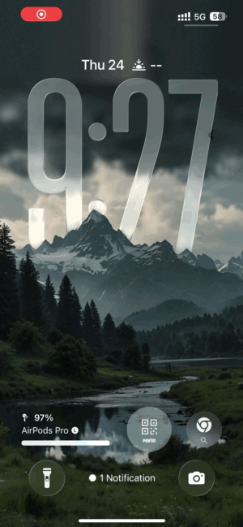
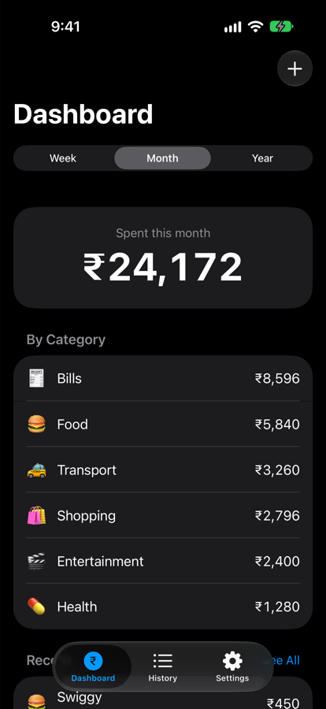
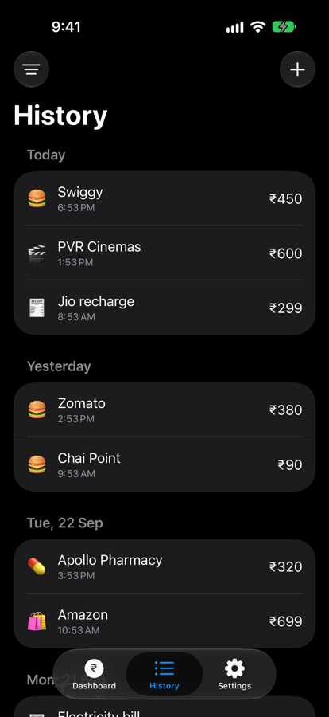
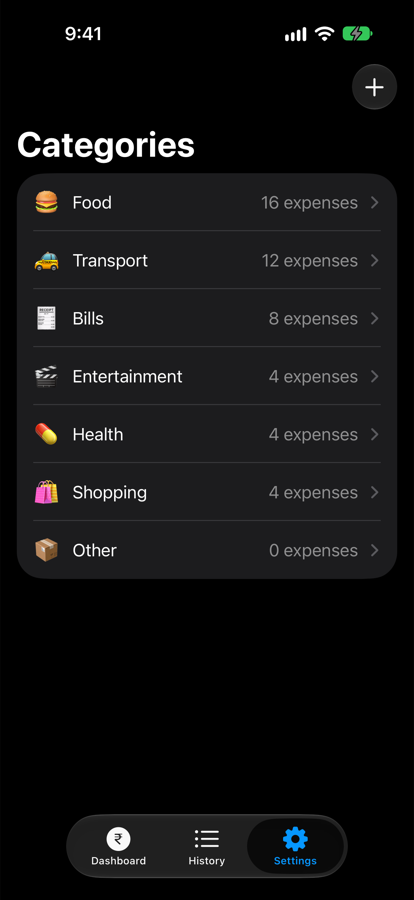
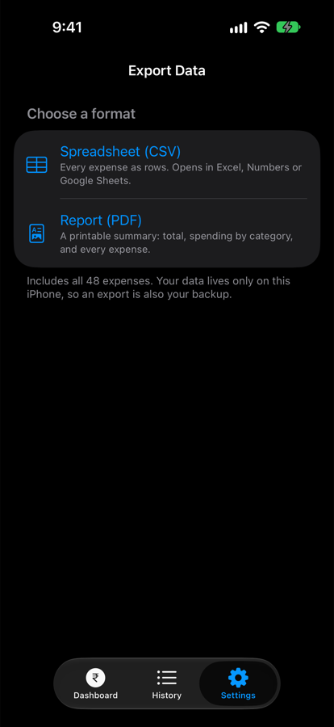
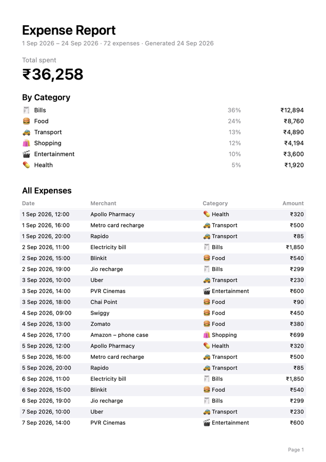
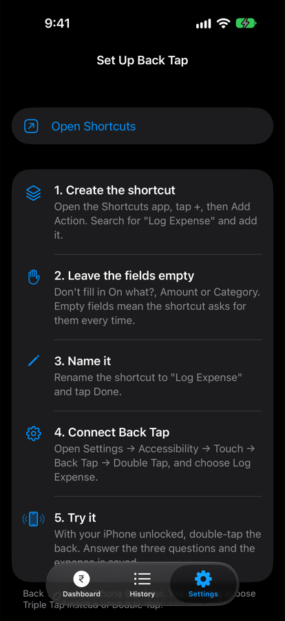

<p align="center">
  
</p>

<h1 align="center">BudgetApp</h1>

<p align="center">
  A personal expense tracker for iPhone where logging a purchase takes about five seconds:<br>
  <b>double-tap the back of the phone → type what it was → type the amount → pick a category.</b> Done.
</p>

<p align="center">
  Swift · SwiftUI · SwiftData · App Intents · Swift Testing · iOS 26 · no third-party dependencies
</p>

<p align="center">
  
  <br><sub>Recorded on an iPhone 13: double-tap the back, answer three prompts, saved.</sub>
</p>

<p align="center">
  
  
  
  
</p>

## Why

Most expense trackers don't fail because they lack features. They fail because opening an app, finding the add button and filling in a form is just enough friction that people stop logging after a week.

BudgetApp puts entry one gesture away. iPhone's **Back Tap** accessibility feature runs a Shortcut that calls the app's **Log Expense** action. iOS asks three quick questions in a pop-up over whatever you're doing, and the expense is saved without the app ever opening.

## Features

- **Back Tap quick entry.** "On what?" → amount (number pad) → category. Saved silently, in about five seconds.
- **Dashboard.** Switch between this week, month or year. See the total, spending by category (highest first) and the latest expenses. The chosen period is remembered.
- **History.** Every expense, grouped by day ("Today", "Yesterday", "Mon, 21 Sep"). Search by merchant (ignores case and accents), filter by category, swipe to delete, tap to edit.
- **Categories.** Seven defaults, each with an emoji. Add your own, rename them, and move all of a category's expenses elsewhere. A category can't be deleted while it's in use or if it's the last one. Every list shows the most-used categories first.
- **Export.** A **CSV** spreadsheet for Excel, Numbers or Google Sheets, or a **PDF** report with totals, a category breakdown and a paginated table of every expense.
- **Private by design.** Everything stays on the iPhone. No account, no server, no network access.
- **Indian rupees**, with Indian digit grouping (₹1,23,456). Dark mode throughout.

<p align="center">
  
  
</p>

## How quick entry works

```
Back Tap (double-tap the back of the iPhone)
   └─▶ Shortcut containing the "Log Expense" action
         └─▶ LogExpenseIntent (App Intents, runs inside the app's process)
               ├─ asks "On what?"      → String
               ├─ asks "Amount (₹)"    → Int, number pad
               ├─ asks "Category"      → list from CategoryQuery, most-used first
               └─▶ ExpenseService.add(...) → SwiftData store on the device
```

The intent has no default values, so iOS prompts for each parameter in order. It requires an unlocked device and returns no dialog, so the entry saves without interrupting you.

## Architecture

```
Back Tap → Shortcut → LogExpenseIntent ──┐
                                         ├──→ Services ──→ SwiftData store (on device)
SwiftUI screens (Add/Edit, Categories) ──┘       ↑
                                                 │ read-only
SwiftUI screens (Dashboard, History) ── queries ─┘
```

- **Every write goes through a service** (`ExpenseService`, `CategoryService`). The Shortcut and the app's screens therefore share one set of rules, for example "amount must be more than ₹0" or "category names are unique regardless of case". An invalid edit changes nothing.
- **Screens read through SwiftData `@Query`**, so lists refresh by themselves when the Shortcut saves an expense.
- **Calculations are plain functions** with no UI or database code. `PeriodCalculator` (Monday-start weeks), `SpendingSummary`, `HistoryFilter`, `CSVExporter` and `PDFReport` are all tested directly.
- **No view model per screen.** `@Query` is designed to live in views, and a view-model layer would add code without adding value at this size.
- **The intent lives in the main app target**, so it shares the app's database and needs no paid developer-account capabilities.

<details>
<summary><b>Project structure</b></summary>

```
BudgetApp/
├── App/           # Entry point, tab bar, the shared SwiftData container
├── Models/        # Expense, Category (@Model)
├── Services/      # ExpenseService, CategoryService, PeriodCalculator, SpendingSummary,
│                  # HistoryFilter, CSVExporter, PDFReport, ExportWriter
├── Intents/       # LogExpenseIntent, CategoryEntity + CategoryQuery
├── Features/
│   ├── Dashboard/
│   ├── History/
│   ├── ExpenseForm/   # Add / Edit
│   └── Settings/      # Categories, Export, Back Tap guide
└── Shared/        # ₹ formatting, the expense row
BudgetAppTests/    # Swift Testing suites
docs/SPEC.md       # Product spec and decision log
tools/             # Script that draws the app icon
```
</details>

## Design decisions worth mentioning

- **Kept the iOS pop-up over a custom screen.** iOS draws a text prompt smaller than a number prompt, and apps can't change the fonts of system UI. A full-screen in-app entry screen with matching big text was built and tried, then dropped: a pop-up over whatever is on screen beat switching to a full-screen app. The trade-off is recorded in [`docs/SPEC.md`](docs/SPEC.md).
- **Money is an `Int` of whole rupees**, not a `Double`, so totals never pick up floating-point rounding errors.
- **Weeks always start on Monday**, whatever the phone's region setting, and a period includes its first instant but not the next period's first instant. Tests pin down Sunday nights, New Year and leap years.
- **Exports are written as real files before sharing.** Handing the share sheet plain text made some destinations save a `.csv` as `.txt`.
- **The CSV escapes commas, quotes and line breaks**, and prefixes text starting with `=`, `+`, `-` or `@` with an apostrophe so spreadsheets don't run it as a formula (CSV injection).

## Testing

**80 tests (102 cases with parameterised inputs) across 8 suites**, written with Swift Testing. Each test gets its own in-memory SwiftData container, and dates are built in a fixed time zone so results are the same on any machine.

| Suite | Covers |
|---|---|
| ExpenseService | Validation, trimming, add, edit and delete; an invalid edit changes nothing |
| CategoryService · Category management | Default categories, usage order, unique names, emoji validation, move all, delete rules |
| PeriodCalculator | Monday-start weeks, month and year boundaries, leap years, weeks across New Year |
| SpendingSummary | Totals, per-category amounts, period boundaries, recent expenses |
| HistoryFilter | Search (case- and accent-insensitive), category filter, day grouping, day titles |
| CSVExporter · Export | CSV format and escaping, formula defusing, real `.csv`/`.pdf` files, PDF contents and pagination |

Run them with **⌘U** in Xcode, or from the command line:

```sh
xcodebuild test -project BudgetApp.xcodeproj -scheme BudgetApp \
  -destination 'platform=iOS Simulator,name=iPhone 18 Pro'
```

(Swap in the name of any simulator you have installed.)

## Getting started

**Requirements:** Xcode 27, and an iPhone on iOS 26 (Back Tap needs a real iPhone 8 or later). A free Apple ID is enough to run it on your own phone.

1. Clone the repo and open `BudgetApp.xcodeproj`.
2. Under **Signing & Capabilities**, choose your own team and change the bundle identifier to something unique.
3. Select your iPhone and press **⌘R**.
4. Set up Back Tap (the app has the same guide under Settings → Set Up Back Tap):
   1. In **Shortcuts**, create a shortcut with the **Log Expense** action and leave its fields empty.
   2. Go to **Settings → Accessibility → Touch → Back Tap → Double Tap** and choose that shortcut.

With a free Apple ID, the app stops opening after 7 days. Run it from Xcode again to reinstall it; your data is kept as long as you don't delete the app.

## Not in scope (yet)

Income, budgets, recurring expenses, widgets, iCloud sync, charts and multiple currencies. These were left out on purpose to keep the first version focused on fast entry. See the spec for the full list.

---

Built by **Madhav Agrawal** ([@Madhav0637](https://github.com/Madhav0637)) as a learning and portfolio project. Released under the [MIT License](LICENSE).
